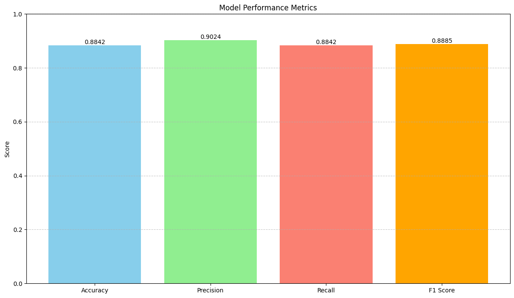
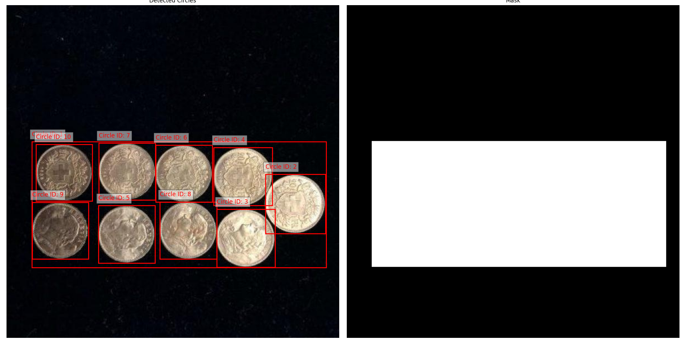
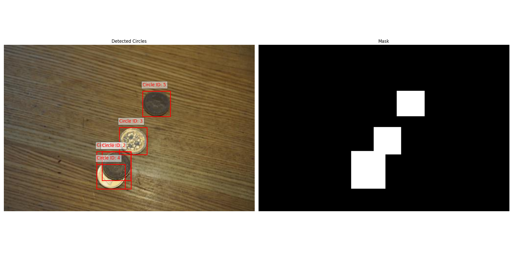
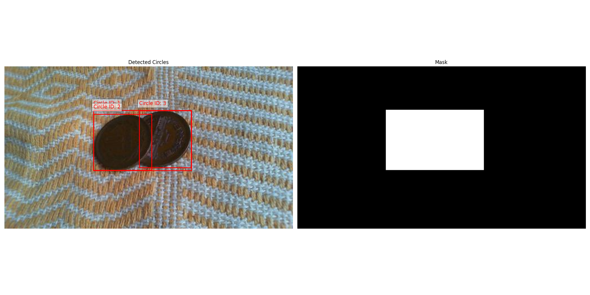

# Model Evaluation for Circle Detection

This project evaluates the performance of Microsoft's Florence2 model that we are using for circle detection task using a dataset of coin images. Florence2 is an advanced open-source vision model that integrates both natural language understanding and computer vision concepts.

## Project Overview

We use Florence2 to detect and count circles (coins) in images, demonstrating its capability to understand and process visual information based on natural language prompts. Here, we will evaluate its performance. We 

## Folder Structure

- `image_coin_counter.py`: Script to process images and count circles using Florence2
- `evaluation.ipynb`: Jupyter notebook for analyzing results and generating metrics
- `result`: This folder includes the result of the evaluation and annotated pictures that our model made mistakes on 

## Usage

1. Run `image_coin_counter.py` to process images with Florence2:
   ```
   python model_evaluation/image_coin_counter.py
   ```
   This script:
   - Processes images from `data/coin-dataset/`
   - Uses Florence2 to detect and count circles in each image
   - Saves results to `data/model_eval_data/circle_counts_florence.csv`

2. Open and run `evaluation.ipynb` to analyze results:
   - Loads predicted counts from Florence2 and true circle counts
   - Calculates performance metrics
   - Generates visualizations

## Evaluation Process

1. Images are processed by Florence2 to detect and count circles
2. Predicted counts are compared with ground truth data - manually counted by myself
3. Metrics (Accuracy, Precision, Recall, F1 Score) are calculated
4. Results are visualized using a bar plot

## Results



22 incorrect results were observed out of the total dataset.

## Analysis

Florence2 demonstrates strong performance in circle detection, with high accuracy and balanced precision and recall. The F1 score of 0.8885 indicates good overall performance, especially considering the model's generalist nature (designed for both language and vision tasks).

Challenges in detection are primarily attributed to after investigating what lead to 22 incorrect results.:
1. Varying lighting conditions in images
2. Overlapping circles (coins) that may confuse the model







These results showcase Florence2's capability to adapt to specific visual tasks like circle counting, despite being a more general-purpose vision and language model.

## Future Improvements

- Fine-tune Florence2 specifically for circle/coin detection tasks
- Augment the dataset with more diverse lighting conditions and coin arrangements
- Investigate Florence2's performance on related tasks (e.g., coin denomination recognition)
- Optimize API performance for high-volume requests

For detailed implementation and full analysis, refer to the individual script and notebook in this directory.