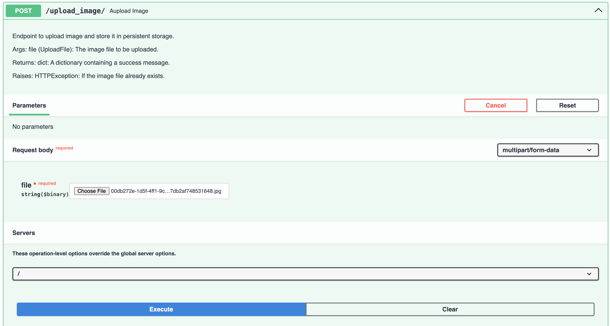
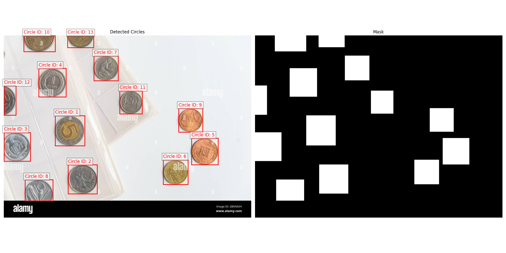

# Service folder - `service`

This folder contains the FastAPI application that serves as the backend for the circle detection service.

## Contents

- `__init__.py`: Initializes the service module
- `app.py`: Defines the FastAPI application and its endpoints
- `screenshots`: A folder containing screenshot of the `upload_image` endpoint and the result from `get_annotated_circle_image`

## API Endpoints & its Usage

The `app.py` file contains the following endpoints:

1. `POST /upload_image/`
   - Uploads an image file and detects circles as it calls `circle_detector.get_circle_data` method
   - Parameters: `file` (UploadFile)
   - Returns: A message indicating successful upload or if the image already exists

Input:



Output:

```json
{
  "message": "Image '00db272e-1d5f-4ff1-9cd6-1d8be42cb1a5_jpg.rf.f5818b173262a6f187db2af748531648.jpg' uploaded successfully."
}
```

2. `POST /get_annotated_circle_image/`
   - Generates and returns an annotated image with bounding boxes and masks of the image that has been uploaded and its information is stored in the database
   - Parameters: `image_name` (ImageName)
   - Returns: StreamingResponse with the processed image

Input:

```json
{
  "image_name": "00db272e-1d5f-4ff1-9cd6-1d8be42cb1a5_jpg.rf.f5818b173262a6f187db2af748531648.jpg"
}
```

Output:



3. `POST /get_circle_data/`
   - Retrieves data for all circles detected in a specified image
   - Parameters: `image_name` (ImageName)
   - Returns: CircleData containing image names, circle count, and metadata - bounding box, center point, and radius

Input:

```json
{
  "image_name": "00db272e-1d5f-4ff1-9cd6-1d8be42cb1a5_jpg.rf.f5818b173262a6f187db2af748531648.jpg"
}
```

Output:

```json
{
    "image_name": "00db272e-1d5f-4ff1-9cd6-1d8be42cb1a5_jpg.rf.f5818b173262a6f187db2af748531648.jpg",
    "circle_count": 13,
    "metadata": [
        {
            "circle_id": 1,
            "bounding_box": [
                269.75,
                420.60150146484375,
                424.4499816894531,
                578.5065307617188
            ],
            "center_point": [
                347.09999084472656,
                499.55401611328125
            ],
            "radius": 77.34999084472656
        },
        {
            "circle_id": 2,
            "bounding_box": [
                337.3499755859375,
                678.9915161132812,
                490.7499694824219,
                831.154541015625
            ],
            "center_point": [
                414.0499725341797,
                755.0730285644531
            ],
            "radius": 76.08151245117188
        },
    .
    .
    ]
}
```

4. `POST /get_circle_properties/`
   - Retrieves properties of a specific circle detected in an image
   - Parameters: `image_circle_request` (ImageCircleRequest)
   - Returns: CircleProperties containing bounding box, center point, and radius of the inquired image

Input:
```json
{
  "image_name": "00db272e-1d5f-4ff1-9cd6-1d8be42cb1a5_jpg.rf.f5818b173262a6f187db2af748531648.jpg",
  "circle_id": 4
}
```

Output:
```json
{
    "circle_id": 4,
    "bounding_box": [
        182.64999389648438,
        172.73851013183594,
        326.9499816894531,
        322.030517578125
    ],
    "center_point": [
        254.79998779296875,
        247.38451385498047
    ],
    "radius": 72.14999389648438
}
```

## Error Handling

- The API endpoints include error handling for cases such as:
  - Image not found
  - Object ID not found
  - Duplicate image uploads

## Notes

- The application uses asynchronous request handling for improved performance
- Uploaded images are stored in a directory specified by `UPLOAD_DIR` in the utilities module
- Circle detection results are stored in a database for quick retrieval
- The application can generate annotated images with bounding boxes and masks for detected circles

Make sure to set up the necessary environment variables and configurations before running the service.